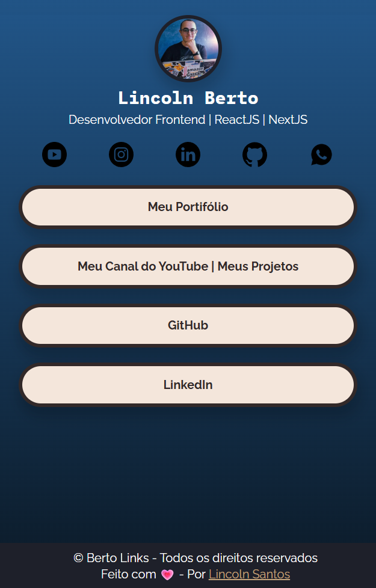

# 🌐 Berto Links

Projeto de uma página estilo _Linktree_ chamada **Berto Links**, criada para centralizar meus principais links de forma elegante e acessível. Ideal para usar na bio de redes sociais.

---

# 🔗 Acesse o Projeto Online

Você pode acessar o projeto diretamente pelo link abaixo:

👉 [Clique aqui para ver o projeto online](berto-links-g0y1rvg97-lincolns-projects-814dfe25.vercel.app)

---

## 🛠️ Como o Projeto Foi Feito

Este projeto foi construído com foco em praticar minhas habilidades em HTML e CSS. A estrutura da página está dividida em três partes principais: perfil, redes sociais e lista de links.

- A seção de perfil mostra minha imagem e uma breve descrição.
- A seção de redes sociais utiliza `flexbox` para alinhar os ícones.
- A seção de links possui estilização com `border-radius`, `box-shadow` e efeito `hover`.

Também apliquei um gradiente no fundo e fontes personalizadas do Google Fonts para deixar a interface mais moderna. O rodapé foi posicionado fixamente na parte inferior da tela.

---

## 🧠 Conceitos Trabalhados

- HTML
- CSS
  - Layout responsivo
  - Uso de `flexbox`
  - Transições e `hover`
  - Bordas arredondadas com `border-radius`
- Estruturação de links sociais e de portfólio

---

## 🔍 Preview do Projeto

---

## 🧱 Tecnologias Utilizadas

- **HTML5**
- **CSS3**

---

## 📄 Licença

Este projeto está licenciado sob a [Licença MIT](https://opensource.org/licenses/MIT).  
Você pode usar, modificar e distribuir livremente. Criado para fins educacionais e prática em desenvolvimento web.
